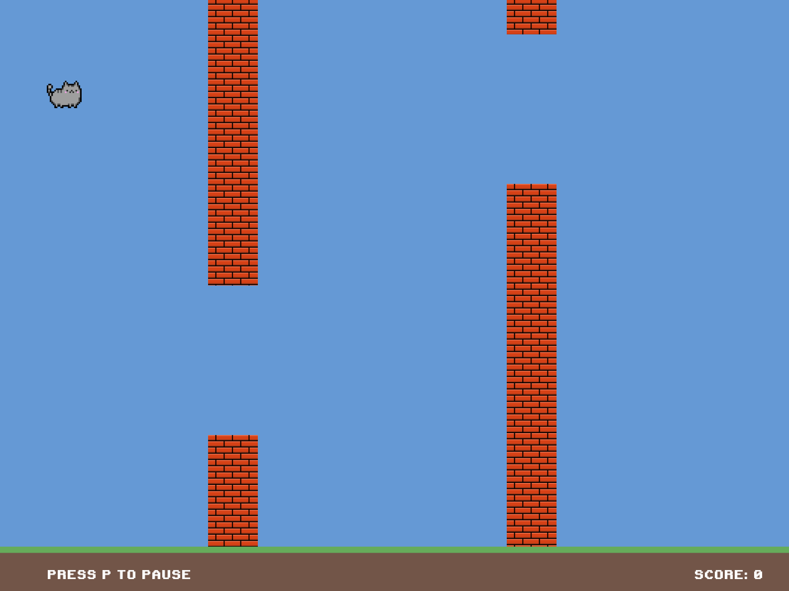
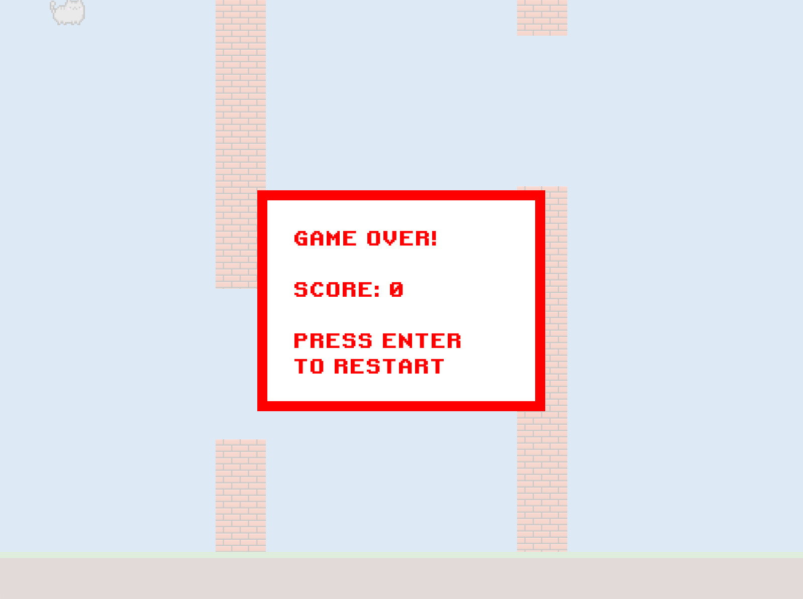
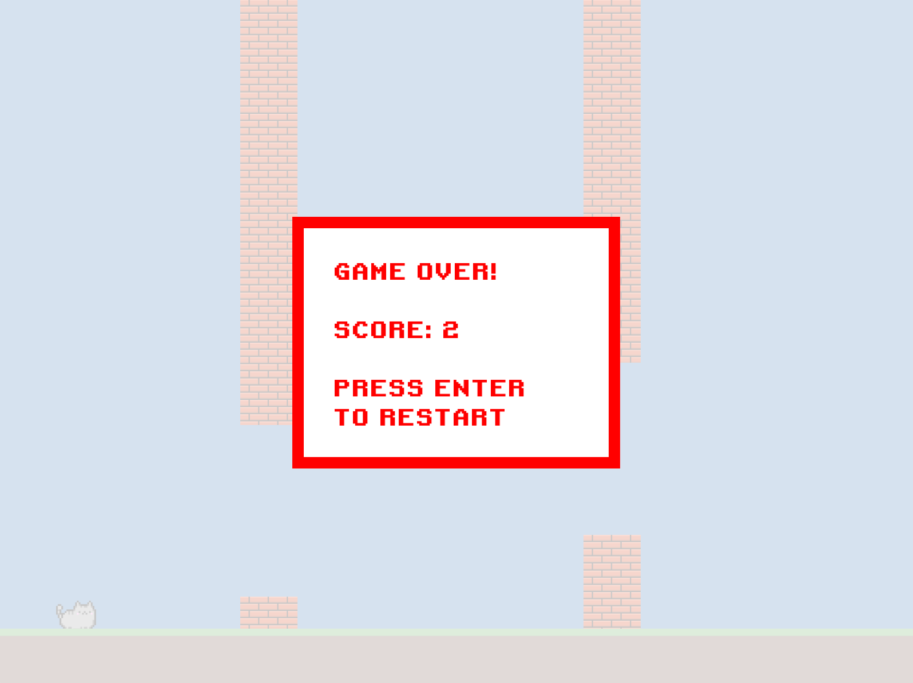
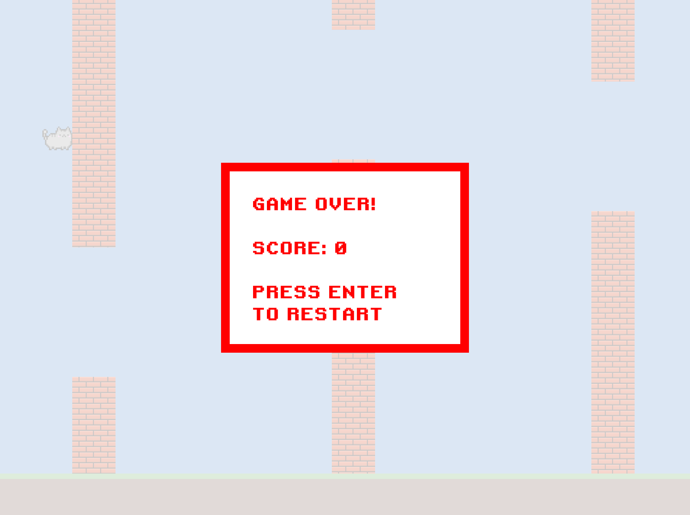
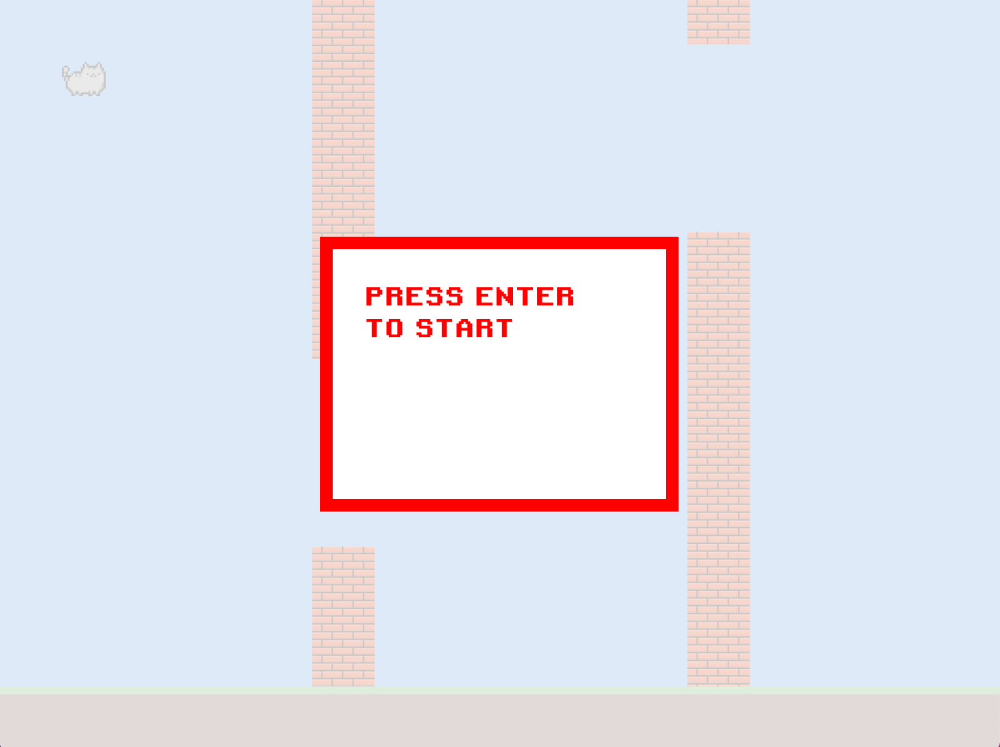
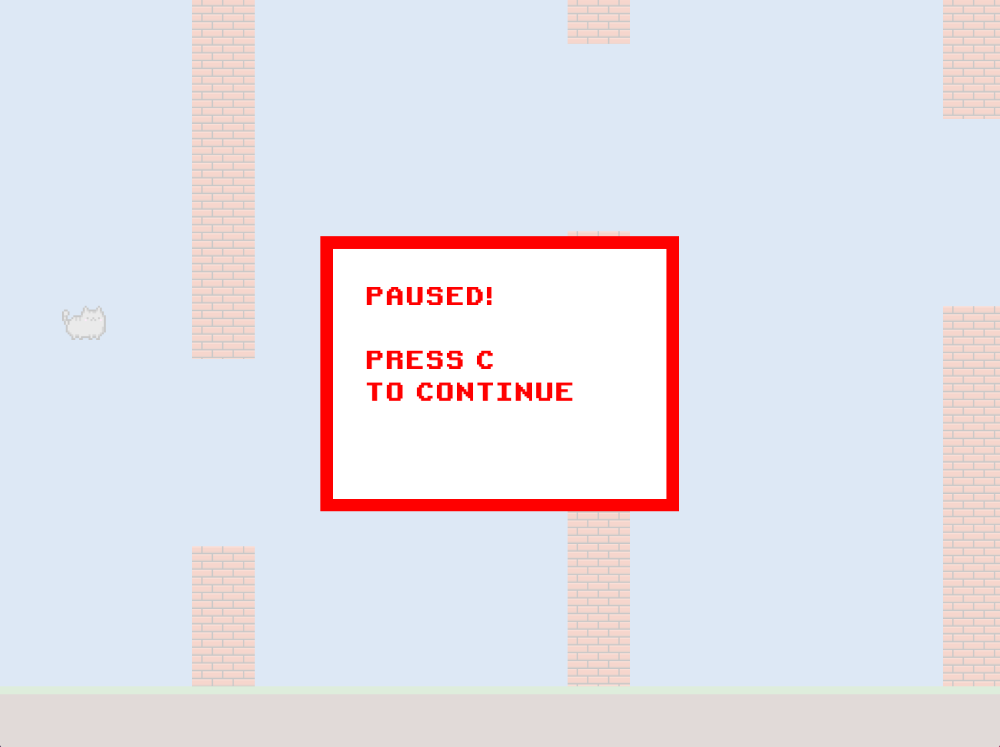

# Flappy Circle

1. How to play
The gameplay is simple – it's similar to the once popular mobile game Flappy Bird. But there is no bird in this game – you would have to guide a cat through the obstacles instead.

* If no key is pressed, the cat just drops to the ground
* To make the cat jump, press Space 
* The rule of three in our game:
  * Don't hit the ceiling! 
  * Don't hit the grass! 
  * Last and probably the hardest, don't hit the wall! 

2. Game feature
* Press Enter to start the game 
* Press P (as in Pause) to pause the game and press C (as in Continue) to continue the game 
* When the game is over, a message box shows up displaying the user's score and prompting the user to press Enter to restart the game 
* Some side features:
  * At the end of the screen, there are two messages: one instructing the user about the aforementioned Pause feature and the other showing the current score as the game progresses.
  * The walls should be gradually moving faster and faster as time goes by.
  * The background should be changing from light blue to dark blue and then light blue again – this signifies the transition from day to night to day in game time.
